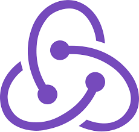

<div style="background: cream">
<p align="center">
  
</p>

<p style="text-align: justify;">Ecommerce web application with user login and registration, login with a Google account, product catalog and search, purchase checkout, profile management and administrative back office.</p>

<h2 >🌐 Online Demo</h2>

<p style="text-align: justify;">You can access the online demo <a>here</a>.</p>

<h2 >🚀 Technologies</h2>
<p style="text-align: justify;">The Frontend <span style="font-size: 20px">🖥️</span> was made with: </p>

<p align="center">
  <a href="https://es.react.dev/" style="text-decoration: none;">
    
  </a>
  <a href="https://mui.com/" style="text-decoration: none;">
    
  </a>
  <a href="https://react-hook-form.com/" style="text-decoration: none;">
    
  </a>
  <a href="https://redux-toolkit.js.org/" style="text-decoration: none;">
    
  </a>
  <a href="https://axios-http.com/" style="text-decoration: none;">
    
  </a>
  <a href="https://reactrouter.com/" style="text-decoration: none;">
    
  </a>
</p>

<p style="text-align: justify;">The Backend <span style="font-size: 20px">🧮</span> was created with: </p>

<p align="center">
  <a href="https://nodejs.org/" style="text-decoration: none;">
    
  </a>
  <a href="https://expressjs.com/" style="text-decoration: none;">
    
  </a>
  <a href="https://jwt.io/" style="text-decoration: none;">
    
  </a>
  <a href="https://sequelize.org/" style="text-decoration: none;">
    
  </a>
</p>

<p style="text-align: justify;">The project contains a RESTful API <span style="font-size: 18px">☎️</span> for the connection between Backend and Frontend, and <a href="https://www.postgresql.org/">Postgres</a> was used for the <span style="font-size: 18px">💾</span>Database.</p>
<p style="text-align: justify;">User avatars and product images are saved in <a href="https://cloudinary.com">Cloudinary</a>.</p>

<h2>✅ Requirements</h2>

<p style="text-align: justify;">Install the latest version of Postgres SQL by clicking <a href="https://www.postgresql.org/">here</a>.</p>

<p style="text-align: justify;">Install the latest version of <a href="https://nodejs.org/">Node</a> to run the development server.</p>

<h2>🏁 Getting Started</h2>

```
# Clone this project
$ git clone https://github.com/christianmxfantin/boavista-shop
```

- Go to the Server folder
- Duplicate the file ".env.example"
- Rename the copy of ".env.example" to ".env"
- Add your postgres database information

```
# Install dependencies on client and server folder
$ npm install
```

Access to server folder and write the following commands:

```
# Create the database
$ npm run db:create

# Run the development server to create the table relationships
$ npm run dev

# Close the server and run the database seeds
$ npm run db:seed

# Run the developmet server again
$ npm run dev

# The server will initialize at <http://localhost:4000>
```

<h2>📝 License</h2>
Made with ❤️ by <a href="https://github.com/christianmxfantin">christianmxfantin</a>

<p></p>
<p></p>

[Back to top](#top)

</div>
